# 🏗️ Architecture Overview

## System Architecture Diagram

```mermaid
graph TB
    subgraph "Frontend Layer"
        UI[🎨 Next.js React App<br/>- Modern UI/UX<br/>- Wallet Connection<br/>- Balance Display<br/>- Claim Interface]
        Components[📦 UI Components<br/>- Shadcn/ui Cards<br/>- Loading States<br/>- Success Animations<br/>- Error Handling]
    end

    subgraph "Web3 Integration Layer"
        Viem[⚡ Viem Client<br/>- Blockchain Interaction<br/>- Smart Contract Calls<br/>- Type Safety]
        Permissionless[🔐 Permissionless.js<br/>- Account Abstraction<br/>- Smart Account Creation<br/>- User Operations]
    end

    subgraph "Circle Paymaster System"
        Paymaster[💳 Circle Paymaster<br/>0x31BE08D380A21fc740883c0BC434FcFc88740b58<br/>- USDC Gas Payment<br/>- EIP-2612 Permits<br/>- Gas Fee Deduction]
        Bundler[📦 Pimlico Bundler<br/>- Transaction Bundling<br/>- Gas Estimation<br/>- User Op Execution]
    end

    subgraph "Smart Contracts"
        AirdropClaimer[🎁 AirdropClaimer.sol<br/>- Token Distribution<br/>- Eligibility Checking<br/>- Claim Validation<br/>- Reentrancy Protection]
        BountyToken[🪙 BountyToken.sol<br/>- ERC20 Implementation<br/>- 1000 TEST tokens<br/>- Transfer Logic]
        USDC[💵 USDC Contract<br/>Arbitrum Sepolia<br/>- Gas Fee Source<br/>- EIP-2612 Support]
    end

    subgraph "Blockchain Network"
        Arbitrum[🌐 Arbitrum Sepolia<br/>- Low Gas Fees<br/>- Fast Transactions<br/>- Ethereum L2]
    end

    %% User Flow
    UI --> Viem
    UI --> Components
    Components --> UI
    
    %% Web3 Integration
    Viem --> Permissionless
    Permissionless --> Paymaster
    Viem --> AirdropClaimer
    Viem --> USDC
    
    %% Circle Paymaster Flow
    Paymaster --> Bundler
    Paymaster --> USDC
    Bundler --> Arbitrum
    
    %% Smart Contract Interactions
    AirdropClaimer --> BountyToken
    AirdropClaimer --> Arbitrum
    BountyToken --> Arbitrum
    USDC --> Arbitrum

    %% Styling
    classDef frontend fill:#e1f5fe,stroke:#01579b,stroke-width:2px
    classDef web3 fill:#f3e5f5,stroke:#4a148c,stroke-width:2px
    classDef paymaster fill:#e8f5e8,stroke:#1b5e20,stroke-width:2px
    classDef contracts fill:#fff3e0,stroke:#e65100,stroke-width:2px
    classDef blockchain fill:#fce4ec,stroke:#880e4f,stroke-width:2px

    class UI,Components frontend
    class Viem,Permissionless web3
    class Paymaster,Bundler paymaster
    class AirdropClaimer,BountyToken,USDC contracts
    class Arbitrum blockchain
```

## 🔄 Transaction Flow Diagram

```mermaid
sequenceDiagram
    participant User as 👤 User
    participant UI as 🎨 Frontend
    participant Viem as ⚡ Viem Client
    participant SA as 🔐 Smart Account
    participant PM as 💳 Circle Paymaster
    participant Bundler as 📦 Bundler
    participant USDC as 💵 USDC Contract
    participant AC as 🎁 AirdropClaimer
    participant Network as 🌐 Arbitrum

    User->>UI: Connect Wallet
    UI->>Viem: Create Public Client
    Viem->>SA: Generate Smart Account
    SA-->>UI: Account Address

    User->>UI: Check USDC Balance
    UI->>Viem: Query USDC Balance
    Viem->>USDC: balanceOf(account)
    USDC-->>UI: Balance: $25.50

    User->>UI: Claim Airdrop
    UI->>Viem: Prepare Claim Transaction
    
    Note over Viem,PM: EIP-2612 Permit Generation
    Viem->>SA: Sign USDC Permit
    SA-->>Viem: Permit Signature
    
    Viem->>PM: Submit User Operation
    Note over PM: paymaster validates permit<br/>calculates gas in USDC
    
    PM->>Bundler: Forward User Operation
    Bundler->>Network: Execute Transaction Bundle
    
    Network->>USDC: Deduct Gas Fee (~$1.50)
    Network->>AC: Execute claimTokens()
    AC->>AC: Validate eligibility
    AC-->>Network: Transfer 1000 TEST tokens
    
    Network-->>UI: Transaction Success
    UI->>User: 🎉 Claim Successful!
    
    Note over User,Network: User paid gas with USDC<br/>No ETH required!
```

## 🎯 Key Innovation Points

### 1. **Circle Paymaster Integration**
- Eliminates ETH gas requirements
- USDC-based gas payments
- EIP-2612 permit system for gasless approvals
- Seamless user experience

### 2. **Account Abstraction**
- Smart accounts via Permissionless.js
- User operation bundling
- Enhanced security and UX

### 3. **Modern Web3 Stack**
- Next.js 15 for performance
- Viem for type-safe blockchain interaction
- Tailwind CSS for responsive design
- TypeScript for code reliability

### 4. **Production-Ready Features**
- Comprehensive error handling
- Real-time balance updates
- Gas fee transparency
- Professional UI/UX design

## 📊 Technical Specifications

| Component | Technology | Purpose |
|-----------|------------|---------|
| **Frontend** | Next.js 15, React 19 | Modern web application |
| **Styling** | Tailwind CSS, Shadcn/ui | Beautiful, responsive UI |
| **Web3** | Viem 2.22.9 | Blockchain interactions |
| **AA** | Permissionless.js 0.2.26 | Account abstraction |
| **Contracts** | Solidity 0.8.0+ | Smart contract logic |
| **Network** | Arbitrum Sepolia | L2 scaling solution |
| **Paymaster** | Circle Paymaster | USDC gas payments |

## 🚀 Deployment Architecture

```mermaid
graph LR
    subgraph "Development"
        Dev[💻 Replit IDE<br/>- Live Development<br/>- Instant Deployment<br/>- Version Control]
    end
    
    subgraph "Production"
        Replit[🌐 Replit Deployment<br/>- Auto-scaling<br/>- HTTPS/SSL<br/>- Global CDN]
    end
    
    subgraph "Blockchain"
        TestNet[🧪 Arbitrum Sepolia<br/>- Smart Contracts<br/>- Circle Paymaster<br/>- USDC Integration]
        MainNet[🏭 Production Ready<br/>- Arbitrum Mainnet<br/>- Base Mainnet<br/>- Real USDC]
    end
    
    Dev --> Replit
    Replit --> TestNet
    TestNet -.-> MainNet
    
    classDef dev fill:#e3f2fd,stroke:#0277bd
    classDef prod fill:#e8f5e8,stroke:#2e7d32
    classDef blockchain fill:#fff3e0,stroke:#f57c00
    
    class Dev dev
    class Replit prod
    class TestNet,MainNet blockchain
```

---

**🏆 This architecture demonstrates a complete, production-ready solution that showcases Circle's Paymaster technology in the most compelling way possible.**
